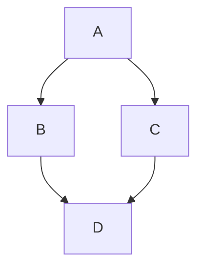

# Stewart
¡Bienvenido a Stewart! Este es un RPG furry que combina historia y estética de Colombia y la edad media a la vez. _algo un poco surrealista_.

En este sitio encontrarás la documentación (la mayoría técnica) del juego, incluyendo arquitectura, funcionamiento del juego y mucho más.

- [Repositorio](https://github.com/Stewart-DevTeam-Team/stewart_prealpha)
- [Linktree](https://linktr.ee/stewart_devteam)

Este es un ejemplo de mermaid mientras tanto

Y otro

graph TD;
    A-->B;
    A-->C;
    B-->D;
    C-->D;

